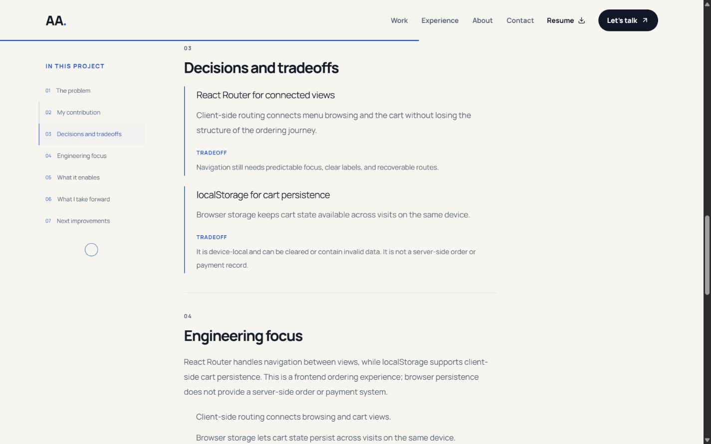
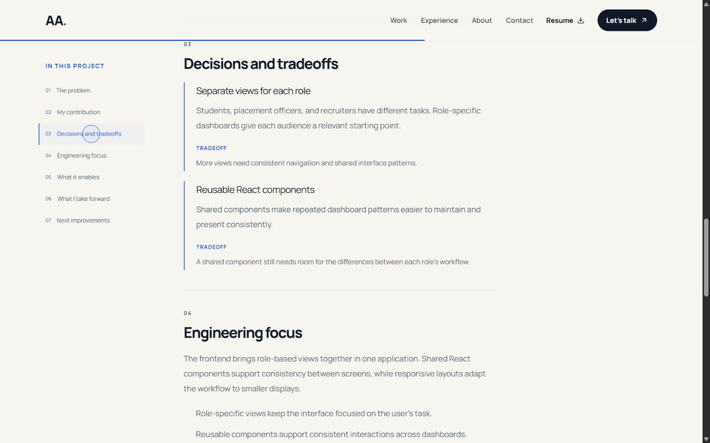
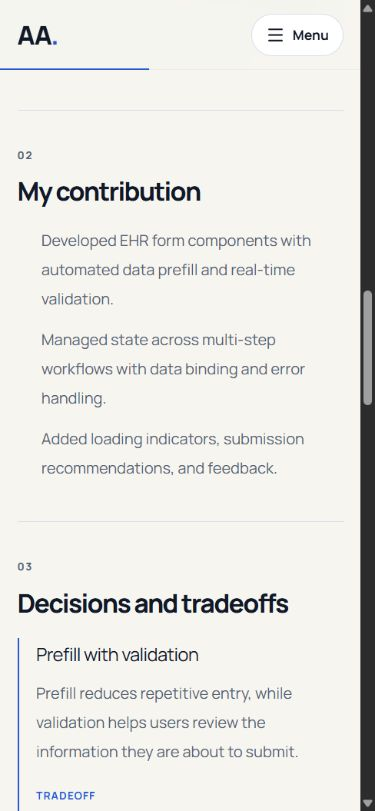
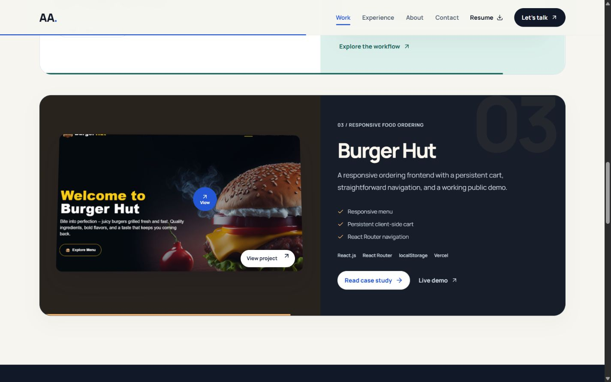
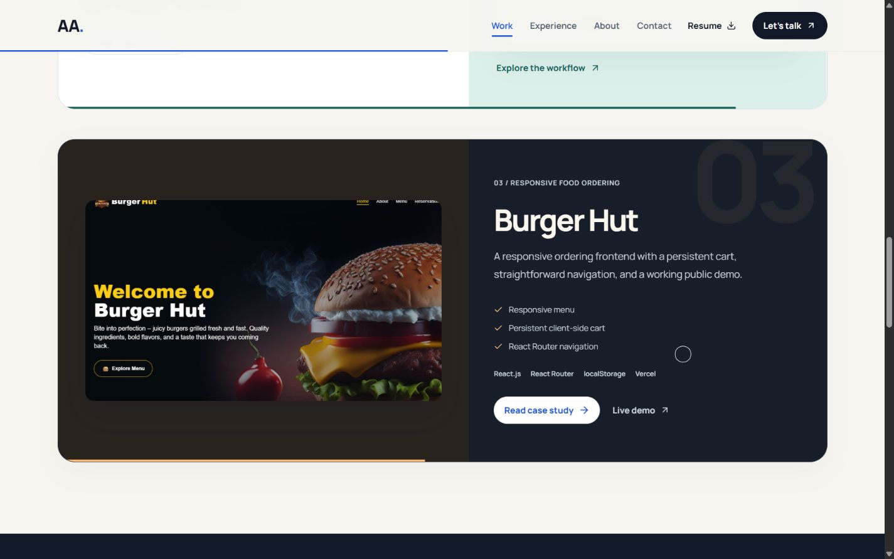

# Phase 5 content and cursor refinement
Date: 4 October 2026. Preview: http://localhost:3001/.

## Implemented
All three case studies now contain seven sections: problem, contribution, decisions/tradeoffs, engineering focus, capabilities, reflection, and next improvements. Decisions explain the rationale and limitations of the existing documented architecture. They do not establish new personal ownership or measured outcomes. Added an evidence panel linking to available demos and repositories, and staggered decision-card entrances.

## Cursor and interaction changes
- Preserved the native pointer for precise clicking; replaced the duplicate dot with a decorative follower.
- Batched pointer updates into one animation-frame callback and cached state/tone changes.
- Tuned a responsive spring, with 26px resting, 36px action, and 56px preview states. Preview state displays View and an arrow.
- Added light contrast on the Burger Hut dark chapter as well as the existing dark sections.
- Reset the follower on route changes, keyboard Tab/Escape, blur, pointer cancellation, and document hiding. Text inputs retain native cursor behavior.
- Added magnetic content to hero CTAs: text/icons move at most 4px horizontally and 3px vertically while the link target stays fixed. Touch/mobile and reduced-motion modes are static.

## Research and design interpretation
[NN/G: purpose of motion](https://www.nngroup.com/articles/animation-purpose-ux/) supports short feedback and clear navigation cues. [NN/G: duration](https://www.nngroup.com/articles/animation-duration/) discusses natural motion and timing. [Codrops: magnetic buttons](https://tympanus.net/codrops/2020/08/05/magnetic-buttons/) and its [custom cursor demo](https://tympanus.net/Tutorials/CustomCursors/) provided creative references; the button article also credits Cuberto as an inspiration. [Motion reduced-motion documentation](https://motion.dev/docs/react-use-reduced-motion) supports the static alternative.

The implemented choice is an adaptation: use a follower and bounded internal movement, preserve a stable click target, and retain the native pointer. It is not an exact clone or a claim that an inspiration site has proven superior usability.

## Validation
Type checking, linting, production build, and all 11 development regressions passed. The build retains the warning for chunks larger than 500 kB and plugin timing overhead.

- Opened all three case studies and exercised decision contents links and next-project navigation.
- Desktop decision cards and 390px mobile/768px tablet reading layouts were inspected; sampled widths had no horizontal overflow.
- Auto Auth has seven content sections and one main/h1.
- Browser confirmed preview mode at 56px while the underlying project link retained cursor:pointer.
- Clicking a dark noninteractive area confirmed resting mode, 26px diameter, and a white follower.
- Tab hid the follower and moved focus to Live demo.
- At mobile width the follower opacity was zero.
- Reduced motion removed the hero canvas, hid the follower, and set both magnetic-content transforms to none. Full motion was restored.
- No new console errors after the verification reload.
- Five saved screenshots were opened for visual inspection. Still images do not demonstrate tracking latency, and magnetic behavior needs real-device usability testing before claiming it is optimal.

## Remaining evidence
Authentic Auto Auth screenshots, project dates/team details, contribution attribution, and measured business outcomes still require owner/source evidence. Direct repository retrieval through web search failed during this pass; no new source verification is claimed. Existing source links and labeled workflow illustration remain. No synthetic product screenshots or invented percentages were added. Phase 5's content work is implemented; its evidence collection is not complete.

## Screenshots

