# Creative portfolio: Phase 1 baseline
Date: 4 October 2026. Captured from current source at http://localhost:3001/ through Codex's in-app browser. These are fresh captures, not previous review evidence.

## Result
The public portfolio and its main journeys are working in the sampled desktop/mobile views. No horizontal overflow or failed images was found in the measured home and project views. One main and one h1 are present. This baseline identifies visual opportunities; it is not a full accessibility or performance certification.

## Journey and evidence
| Step | Surface | Health and findings | Evidence |
|---|---|---|---|
| 1 | Desktop introduction | Clear identity and work/resume actions. Desktop 3D reports ready. A larger headline and stronger composition can make this more memorable. | 01-desktop-home.jpg |
| 2 | Selected work | Anchor navigation works; active Work indicator updates. Featured screenshot is useful, but metadata, features, tags, and actions compete for attention. | 02-desktop-work.jpg |
| 3 | Career Nexus | Project opens and h1 receives focus. Role, audience, source, and demo are available. | 03-desktop-career-nexus.jpg |
| 4 | Case-study contents | Engineering focus anchor works and highlights the current item. Desktop paragraph lines are long; constrain reading width. | 04-desktop-case-reading.jpg |
| 5 | Auto Auth | Next-project navigation works. Source link exists; no inactive demo action. The text-only page needs authentic visual evidence in a later phase. | 05-desktop-auto-auth.jpg |
| 6 | Burger Hut and return | Next project and All projects work. Browser Back returns to Burger Hut; Forward returns to /#work. | 06-desktop-burger-hut.jpg |
| 7 | Contact | Copy email succeeds and announces Email copied to clipboard. Mailto and professional-profile links are present. | 07-desktop-contact.jpg |
| 8 | Reduced motion | Site toggle changes the desktop hero to a static scene and removes the canvas. Setting was restored after checking. | 08-desktop-reduced-motion.jpg |
| 9 | Mobile introduction | Readable hierarchy and visible actions. Location/graduate metadata needs a more explicit separator. | 09-mobile-home.jpg |
| 10 | Mobile menu | Opens; Escape closes and restores focus to Open navigation with aria-expanded=false. Captured over Experience. | 10-mobile-menu.jpg |
| 11 | Mobile work | Stacked project layout fits. View-project cue is visible without hover. | 11-mobile-work.jpg |
| 12 | Mobile Career Nexus | Role/audience/actions wrap without overflow; route opens correctly. | 12-mobile-career-nexus.jpg |
| 13 | Mobile Auto Auth | Text and source action remain accessible without screenshots. | 13-mobile-auto-auth.jpg |
| 14 | Mobile Burger Hut | Screenshot and links render correctly. | 14-mobile-burger-hut.jpg |
| 15 | Tablet introduction | At 768px the two-column hero cramps the headline and stacks its two actions unnecessarily. Stack the hero at tablet widths. | 15-tablet-home.jpg |
| 16 | Experience | Dark contrast section provides useful rhythm. Hidden line breaks can concatenate the heading text on narrow screens; preserve explicit spaces. | 16-desktop-experience.jpg |
| 17 | About and credentials | Skills are linked to evidence, but four bordered cards add visual weight. Use a quieter divider-based presentation. | 17-desktop-about.jpg |

## Priorities
- P2: cramped tablet hero at 768px (step 15). Address in Phase 2.
- P2: long desktop case-study lines (step 4). Address in Phase 2.
- P2: repetitive project presentation and incomplete visual evidence (steps 2, 5). Address in Phases 3 and 5.
- P3: small labels, inconsistent section spacing, redundant boxes (steps 1, 2, 17). Address in Phase 2.
- P3: mobile metadata separation and heading whitespace (steps 9, 16). Address in Phase 2.
- P3: Three.Clock deprecation warnings from the 3D dependency. No browser error was observed; investigate dependency ownership during the later motion/performance phase.

## Checks and limits
Desktop sampled at 1440x900; mobile at 390x844; tablet at 768x1024. Scrollbars reduce screenshot/content width by 15px. Home and each project were measured for overflow, images, main/h1 counts. Resume download completed to the browser's Downloads folder. Clipboard success, menu Escape, route focus, history navigation, section/contents links, and site reduced-motion behavior were exercised.

External destinations were inspected as links rather than used to audit third-party sites. Mailto was not launched and no message was sent. Screen reader testing, system reduced-motion emulation, true 200% zoom, forced clipboard denial, forced WebGL/context-loss errors, real-touch hardware, and field performance remain for Phase 6. Screenshot softness does not establish a font or contrast defect. All 17 saved baseline screenshots were opened and visually inspected before acceptance.

## Screenshots

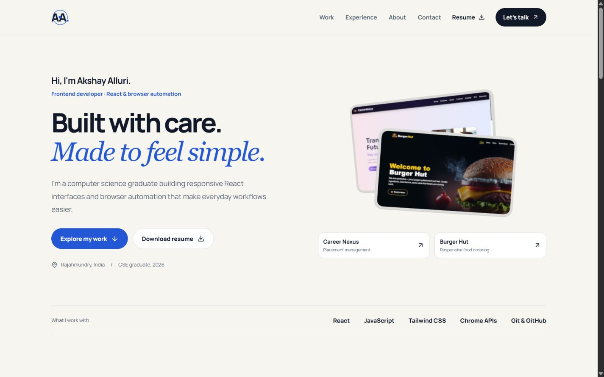

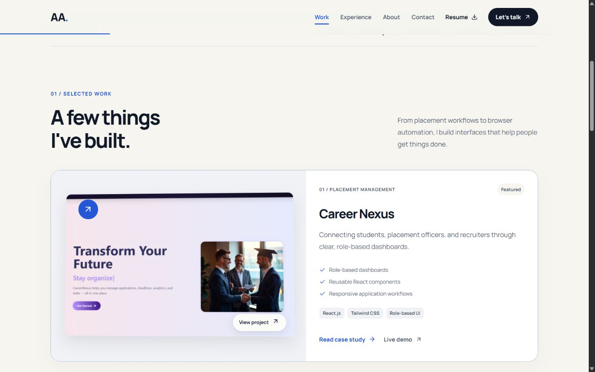

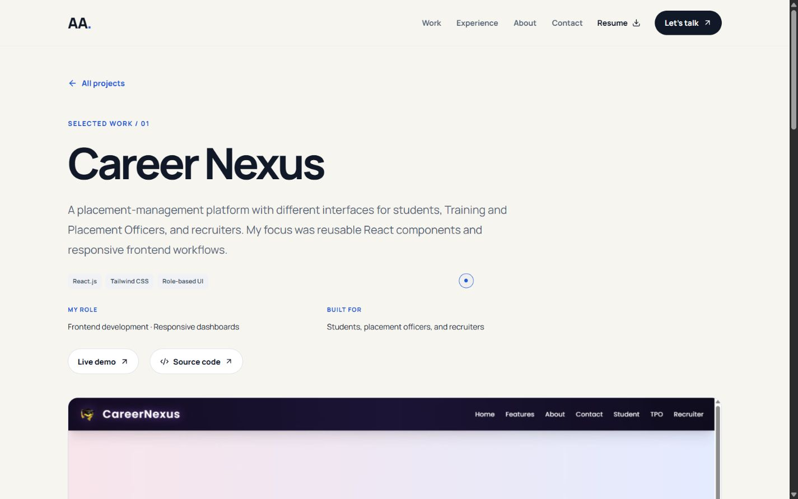

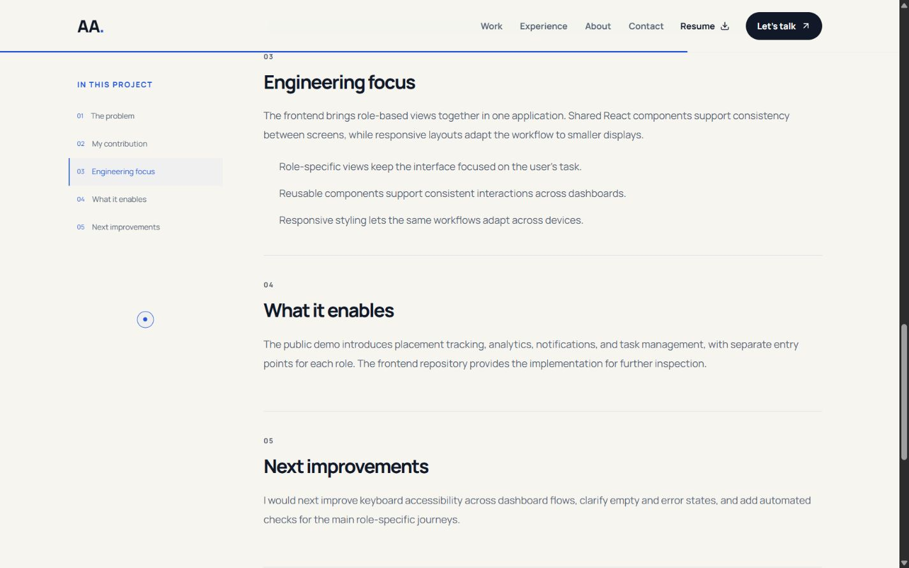

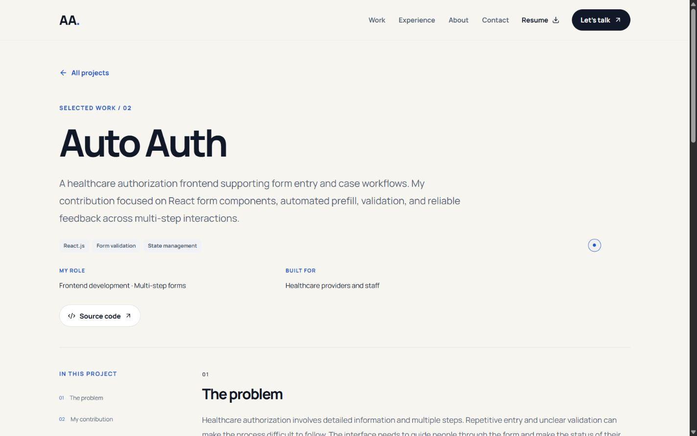

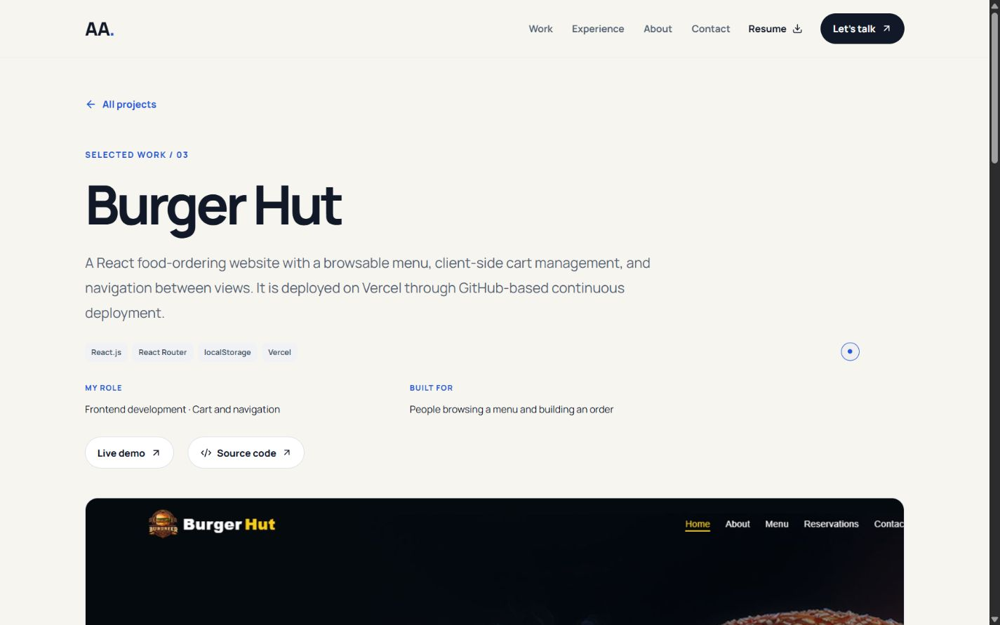

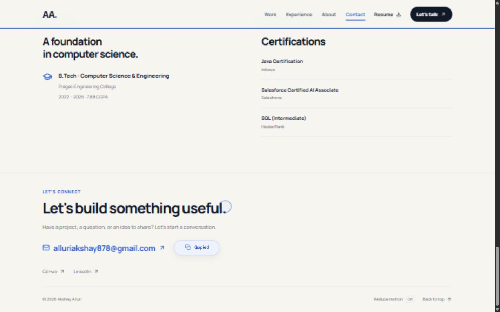

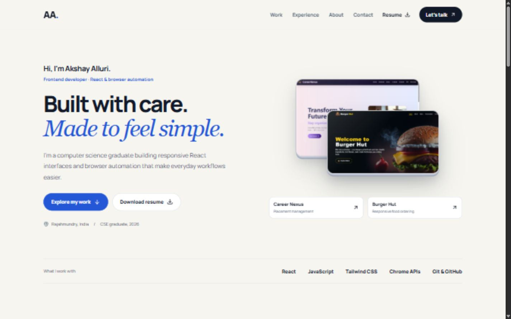

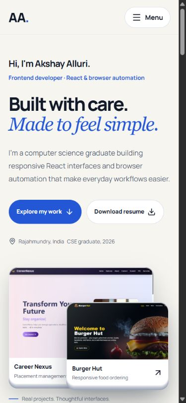

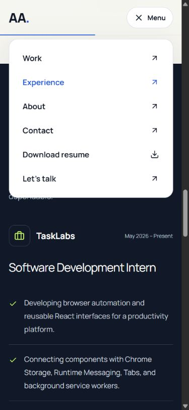

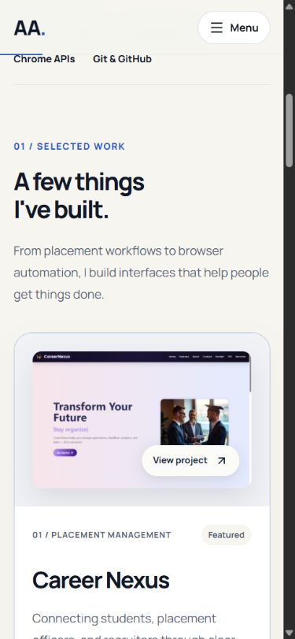

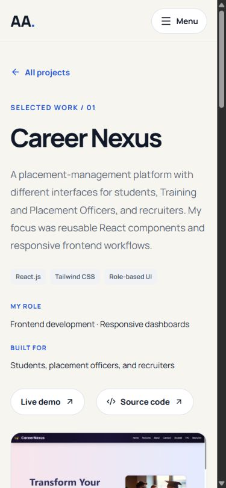

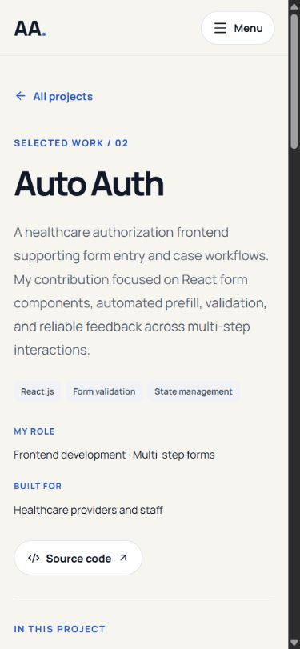

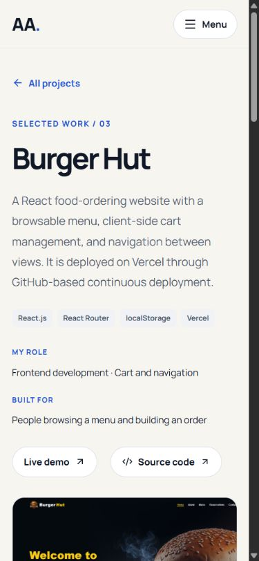

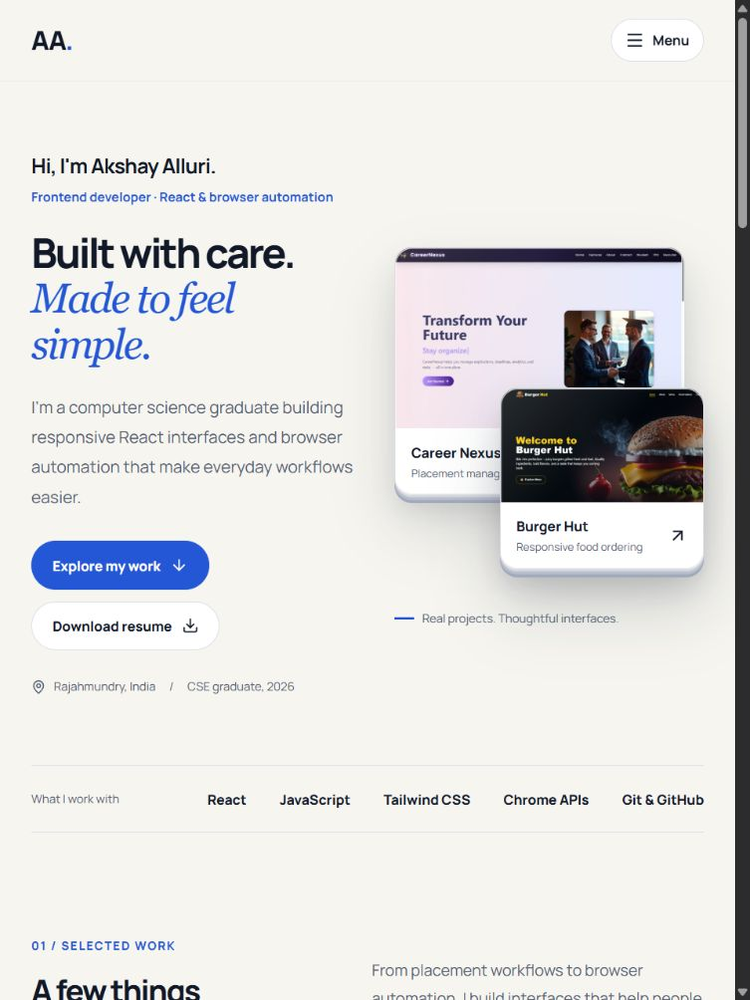

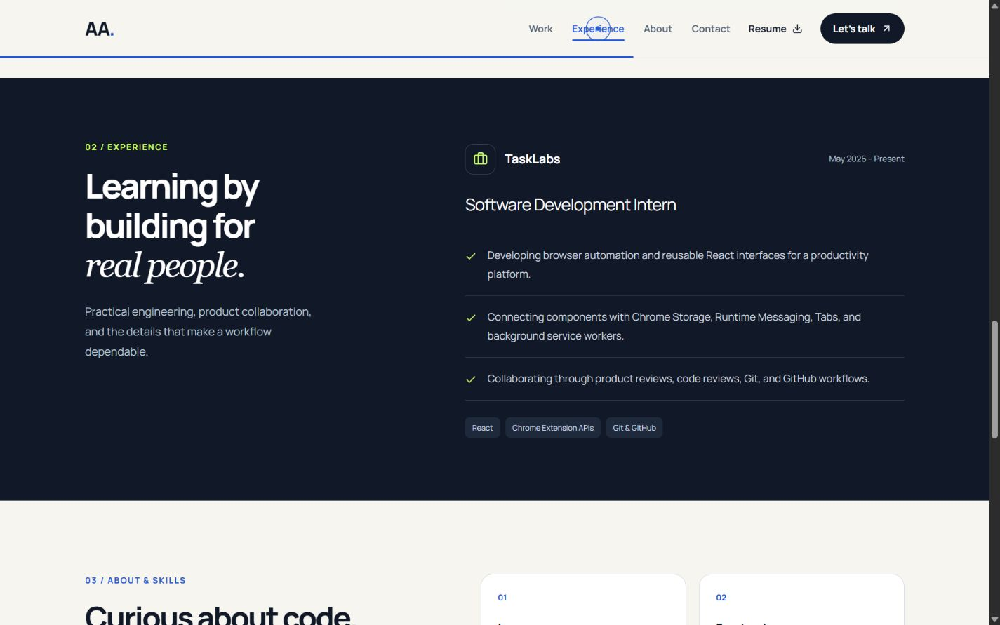

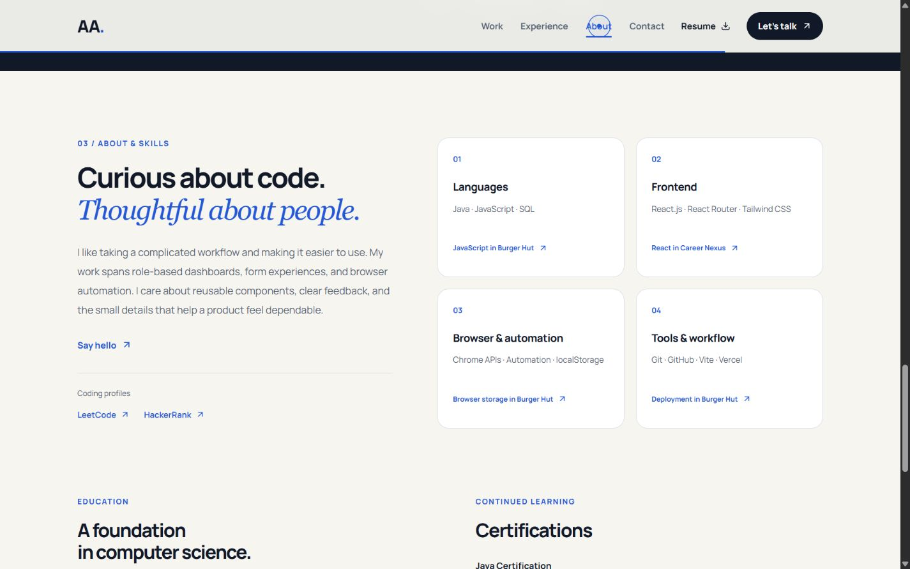

Phase 2 implementation and verification: [report](../creative-phase-two.md).
