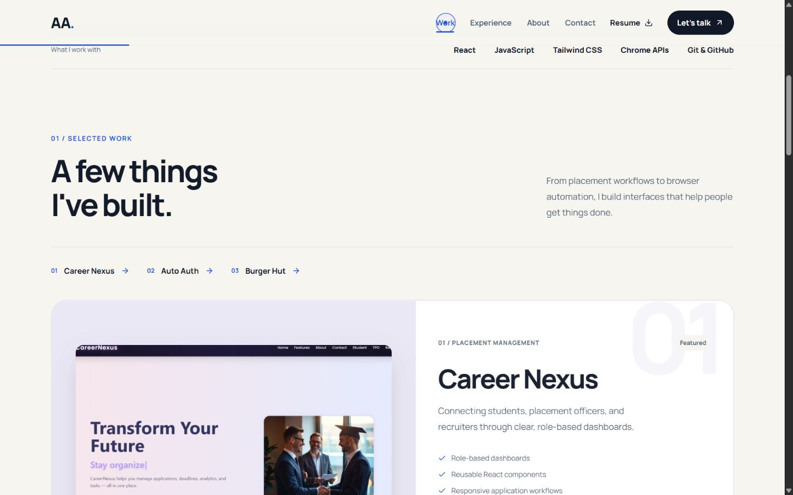
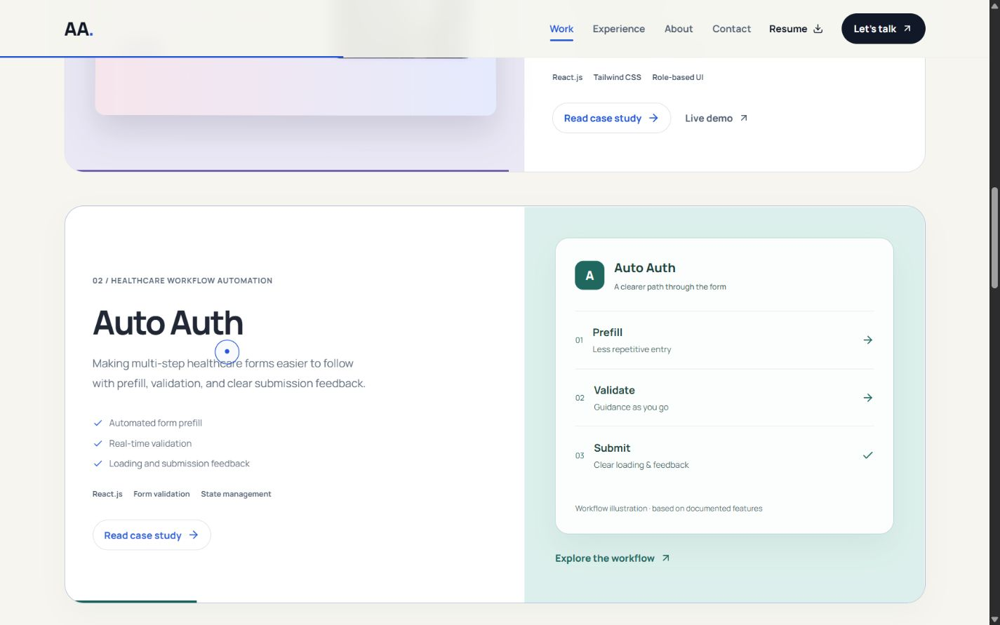
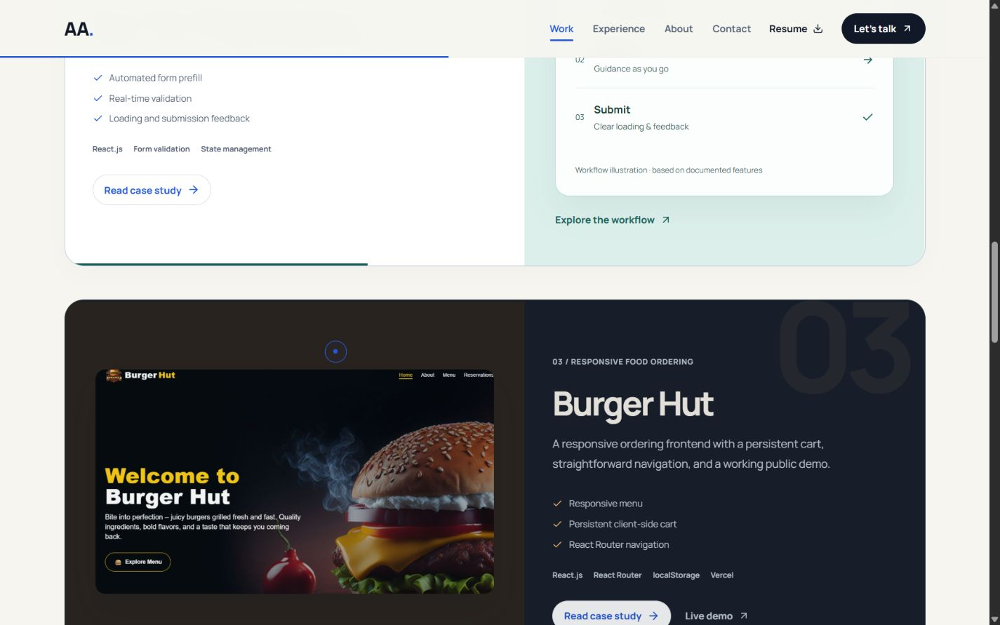
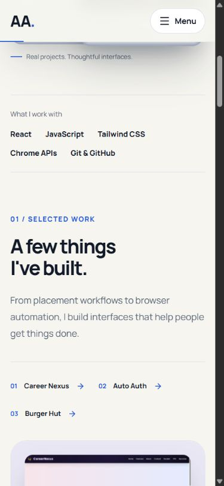
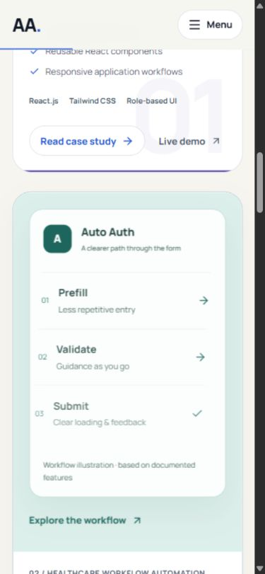
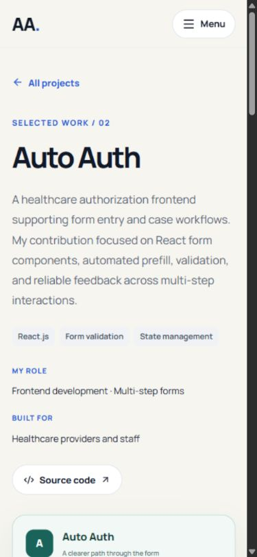
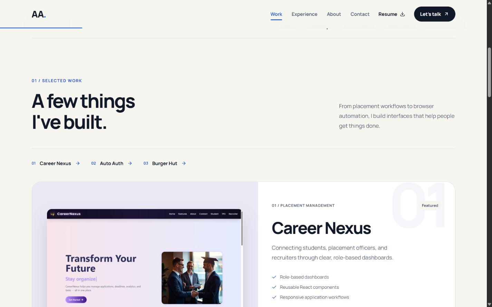
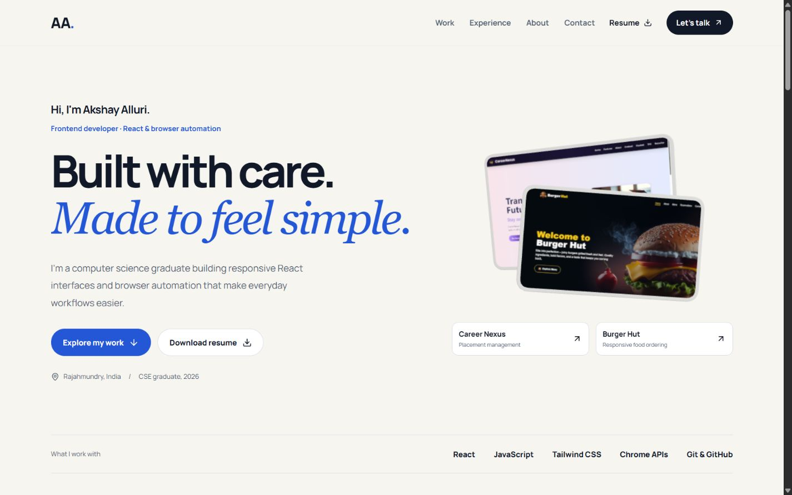
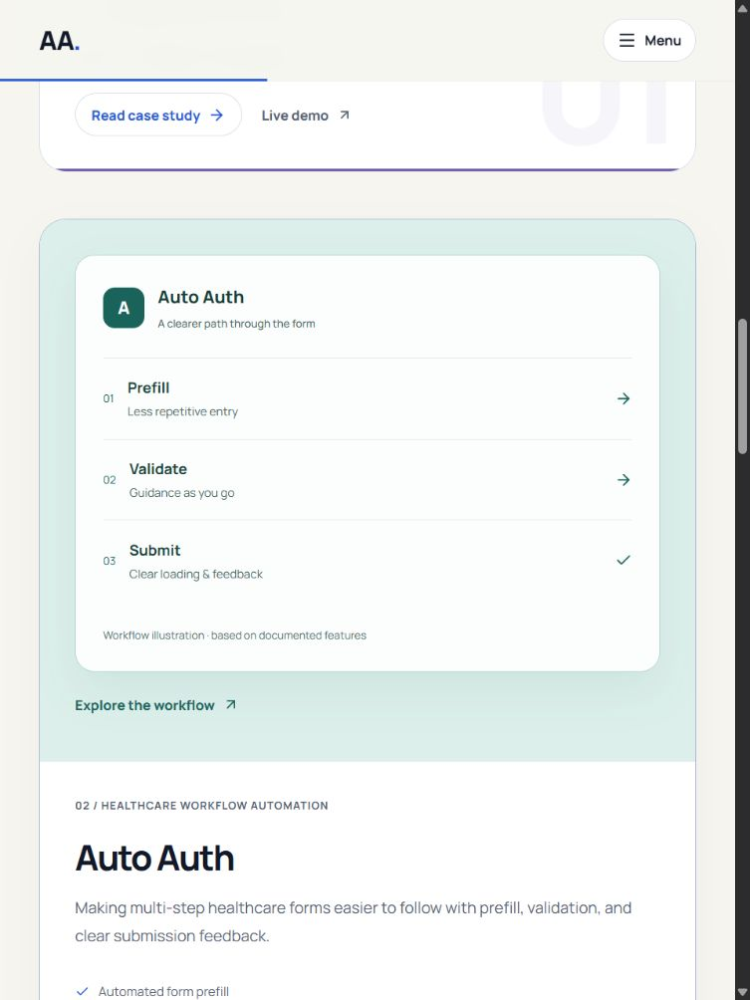
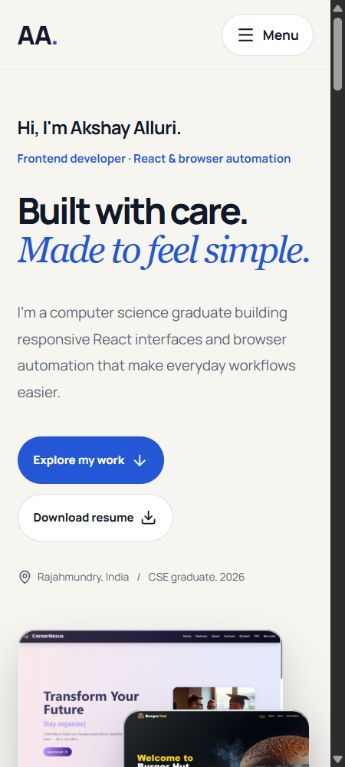

# Creative portfolio: Phases 3 and 4
Date: 4 October 2026. Preview: http://localhost:3001/.

## Phase 3 — Project chapters
Replaced the featured-card plus two-card grid with three full-width, alternating project chapters. Each chapter has a distinct palette, a large editorial number, a clear case-study action, quieter technology labels, and its existing documented capabilities.

- Career Nexus: violet surface with its authentic public screenshot.
- Auto Auth: green surface with a Prefill -> Validate -> Submit workflow illustration. The visible caption identifies it as an illustration based on documented features. It is not a product screenshot, live form, or evidence of a measured outcome. The same illustration appears in the Auto Auth case study.
- Burger Hut: dark surface with its authentic public screenshot and warm accent.
- Added a chapter index with links to each project. Below 900px, every chapter stacks into a single column. No external dependency was added.

## Phase 4 — Motion
- Added individually clipped, staggered hero headline entrances while preserving readable server-rendered content.
- Coordinated project visual/copy reveals and increased shared entrance/page-arrival timing for a more expressive rhythm.
- Added scroll-responsive chapter accents on eligible desktops; mobile and reduced-motion modes use static accents.
- Added staggered workflow-step entrances.
- Increased preview tilt to a bounded 5 degrees, lift to 8px, and arrow travel to 5px. Increased the existing 3D camera pointer response to 4 degrees.
- Kept the existing custom cursor, lazy hero scene, scroll-responsive previews, mobile menu transitions, and route focus behavior.
- The site preference and device reduced-motion preference disable the additions. No loop or autoplay sequence was introduced.

## Validation
- TypeScript: passed.
- ESLint: passed.
- Production build: passed.
- Final development regressions: 11 passed, 0 failed.
- Browser inspected at 360x800, 390x844, 768x1024, 1024x900, and 1440x900. Sampled widths had no horizontal overflow.
- Project chapter index links, Career Nexus/Burger Hut case links, Auto Auth illustration link, and return-to-projects link were exercised.
- Auto Auth page settled at scrollY=0 with focus on its h1. One main and one h1 in sampled home and case views.
- Mobile menu Escape restored focus to Open navigation with aria-expanded=false.
- Keyboard focus reached the Burger Hut preview; its spring lift and preview response were observable in the rendered transform. Chapter progress transforms changed with scrolling.
- Reduced-motion check: data-motion=reduced, zero hero canvases, and no transforms on headline lines, preview surfaces/images, or chapter accents. Full motion was restored afterward.
- All four homepage project image instances were confirmed complete with nonzero naturalWidth after visiting the chapter. Offscreen lazy images were allowed to load before classifying them.
- A transient MotionPreferences context error occurred during development hot replacement. A full reload recovered it, and no new console errors occurred during the subsequent clean-reload and navigation check.
- Ten screenshots were saved and opened for visual review. They show settled layouts; a still image does not demonstrate animation timing.

## Evidence

## Remaining limits
The production build warns about chunks larger than 500 kB and reports plugin timing overhead. The existing Three.Clock deprecation remains. Bundle tuning, real-device performance, system preference emulation, screen-reader checks, zoom testing, and failure injection belong to Phase 6. Authentic Auto Auth screenshots and verified outcomes remain for Phase 5. No deployment was performed.
