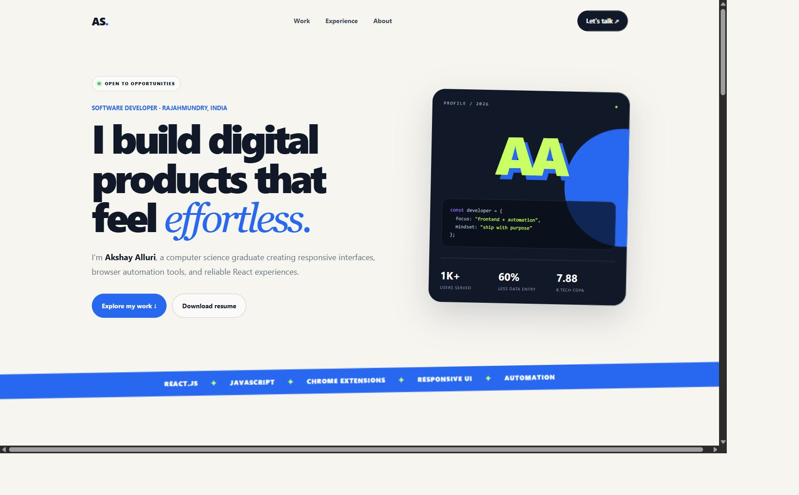
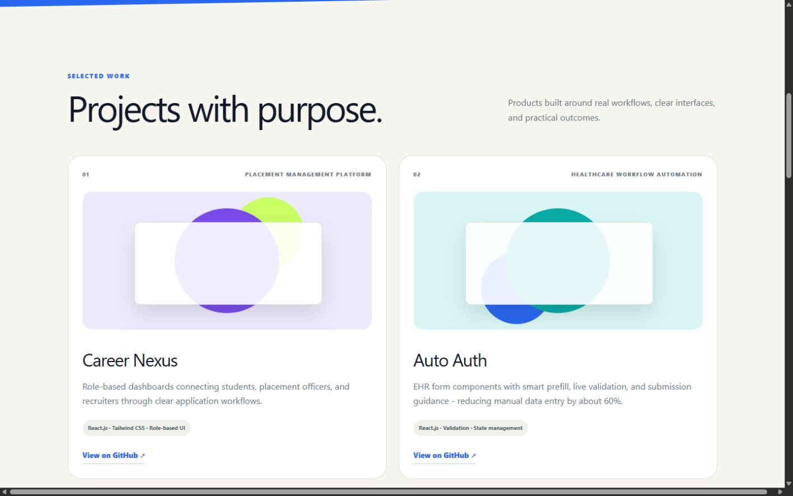
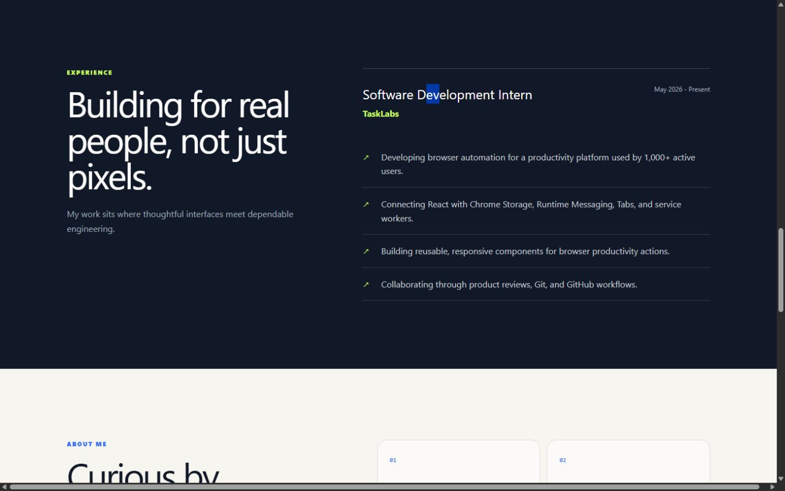
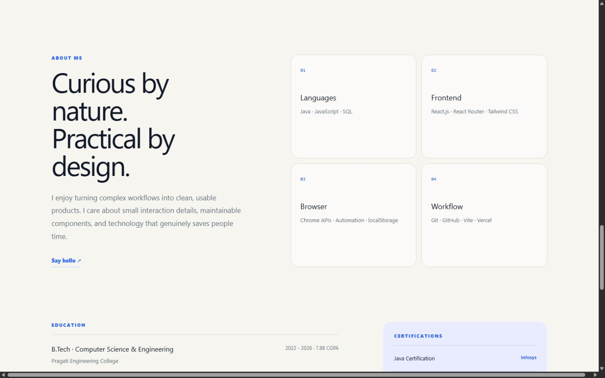
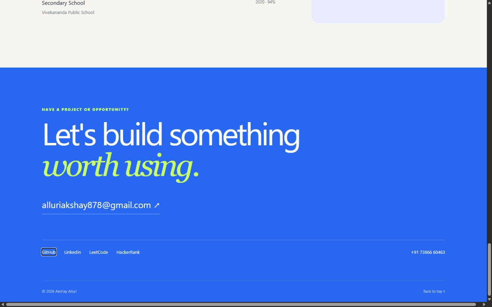
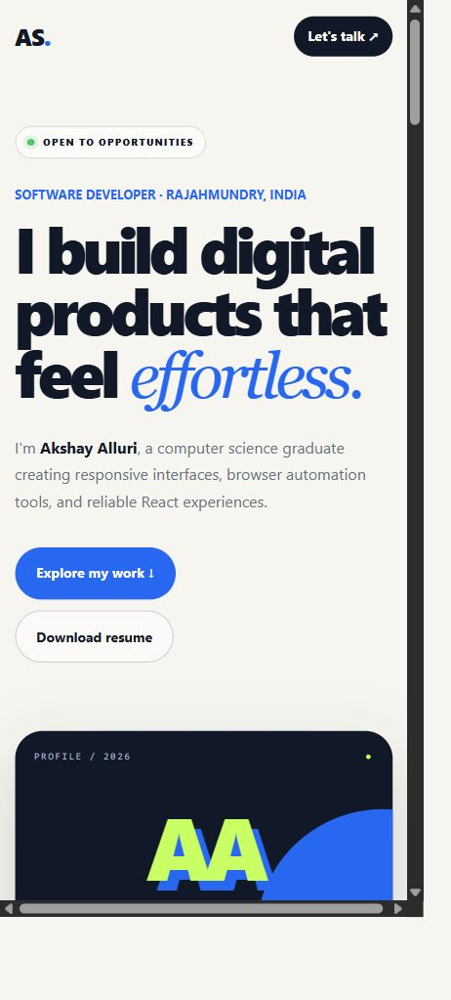
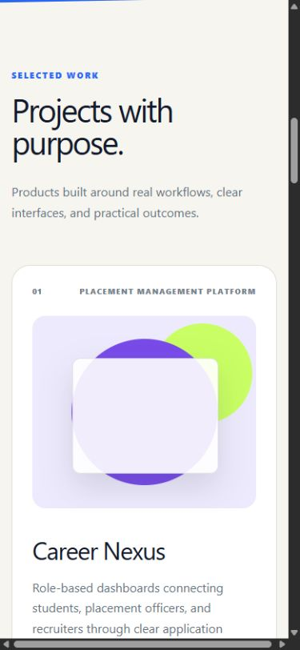

# Phase 1 baseline - 3 October 2026

## Technical result

- Removed the UTF-8 byte-order mark from `.openai/hosting.json`. The normal
  configuration loader and development server now start successfully.
- Added pinned Cloudflare Worker types, configured TypeScript to load them,
  and declared the database binding as optional for the existing guarded helper.
- Added `npm run typecheck` without incremental cache output.
- Replaced obsolete loading-skeleton assertions with six production-worker
  tests for portfolio content, section targets, resume/contact links, external
  link attributes, forwarded-origin social metadata, and not-found routing.
- Rewrote the README around the real portfolio and its optional infrastructure.
- Added the owner-facing [content evidence checklist](content-evidence-checklist.md).

Validation passed: `npm run typecheck`, `npm run lint`, and `npm test` (production
build plus 6/6 tests). The running development server returned HTTP 200 for the
home page, resume PDF, and social preview image. Browser error logs were empty
at the end of the inspection.

## Browser baseline

Captured in the Codex in-app browser against `http://localhost:3000/`.
Desktop and mobile viewport presets were exercised. The browser reported
effective widths ranging from 1440 to 1600 for desktop and 390 to 433 for
mobile around screenshot capture, so these screenshots are a visual baseline,
not a pixel-exact breakpoint acceptance test. The viewport override was reset
and the home page left open for owner inspection.

| Step | Surface and health | Findings |
| --- | --- | --- |
| 1 | Desktop home - usable, refinement needed | Name, role, availability, and both actions are present. Brand says AS while the panel says AA. The panel uses very small labels and prominent outcome claims needing evidence. |
| 2 | Desktop work - usable, evidence incomplete | Work link reaches the correct section. Three projects render; visuals are decorative rather than actual product screenshots. Two project links target organizations. |
| 3 | Desktop experience - usable, content verification needed | Experience navigation reaches the internship section. Dates and platform audience need owner confirmation. |
| 4 | Desktop About/skills - usable, typography refinement needed | About navigation works. Grouped skills and education are present, but supporting labels are small. |
| 5 | Desktop contact - usable for direct links | Email, social, and telephone targets are present. Tabbing from email reaches GitHub; the browser's focus outline is visible. No email client was launched and no message sent. |
| 6 | Mobile home - usable, navigation gap | Hero text and actions stack. Work/Experience/About navigation disappears without a replacement menu. |
| 7 | Mobile work - usable, overflow defect | Explore my work reaches the section and cards stack. Horizontal scrolling is present; one 390px observation measured 380px document scroll width against 375px client width. Desktop overflow was also visible. |

### 1. Desktop home

### 2. Desktop selected work

### 3. Desktop experience

### 4. Desktop About and skills

### 5. Desktop contact and keyboard focus

### 6. Mobile home

### 7. Mobile selected work

## Limits and next work

This is a restoration and baseline capture, not a completed accessibility audit
or redesign. Color contrast, screen-reader behavior, the full keyboard sequence,
reduced motion, zoom resilience, and performance metrics still need focused
verification in later phases. Resume delivery was checked over HTTP; the
browser download workflow was not exercised. External repository/demo pages
were not reverified during this implementation.

The existing page and CSS were kept as the baseline. Address horizontal
overflow, mobile navigation, image evidence, typography, and consistent branding
in the planned layout/design phase. Case studies and animation remain later work.
Content verification remains pending owner responses; existing claims have not
been independently substantiated or expanded.
