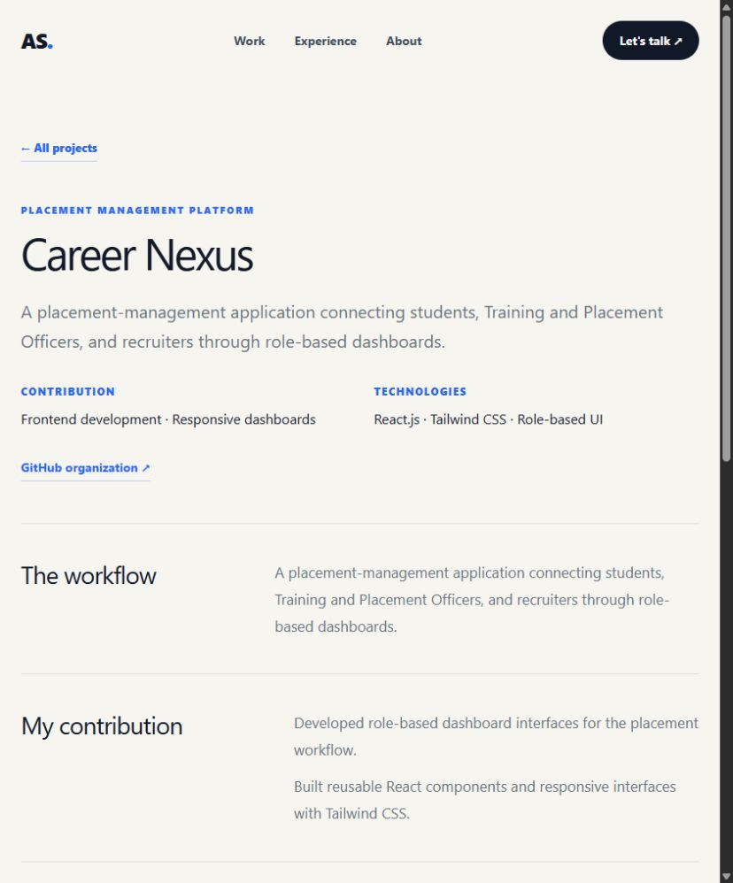
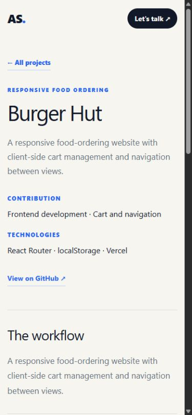

# Phase 2 - content structure and project routing

Implemented on 3 October 2026 using the existing running development server.

## Content and rendering

`app/content/portfolio.ts` owns the typed Profile, Project, Experience,
Credential, and SkillGroup data. The home page composes reusable server-rendered
sections from `app/components/`. Project cards and the project overview layout
share their external-link rendering. Optional demo, repository, organization,
image, and verification URLs produce controls only when provided.

The original home-page content and section anchors remain available. Existing
organization URLs are now labeled as organizations, rather than repositories.
Case-study content comes from the existing portfolio/resume information. Images,
team details, verified results, and fuller engineering stories remain subject to
the [content checklist](content-evidence-checklist.md).

## Routes

- `/projects/career-nexus`
- `/projects/auto-auth`
- `/projects/burger-hut`

Each route resolves a project by its stable slug, renders a shared overview,
sets project-specific page/social metadata, and links to the next project.
Shared navigation returns to the correct home sections. Unknown slugs return
404 with recovery links. The existing resume URL is unchanged.

## Verification

- Type-checking and lint passed.
- `npm run test:dev` passed all eight tests against the running dev server.
- Browser navigation passed from home to Career Nexus, through Auto Auth to
  Burger Hut, through browser Back, and back to the home project section.
- The Burger Hut mobile view reported 375px client and document widths at a
  390px viewport: no horizontal overflow in that captured state.
- The existing home-page mobile navigation gap and decorative strip overflow
  remain recorded in the Phase 1 baseline for the layout phase.
- No production build was run during Phase 2.

